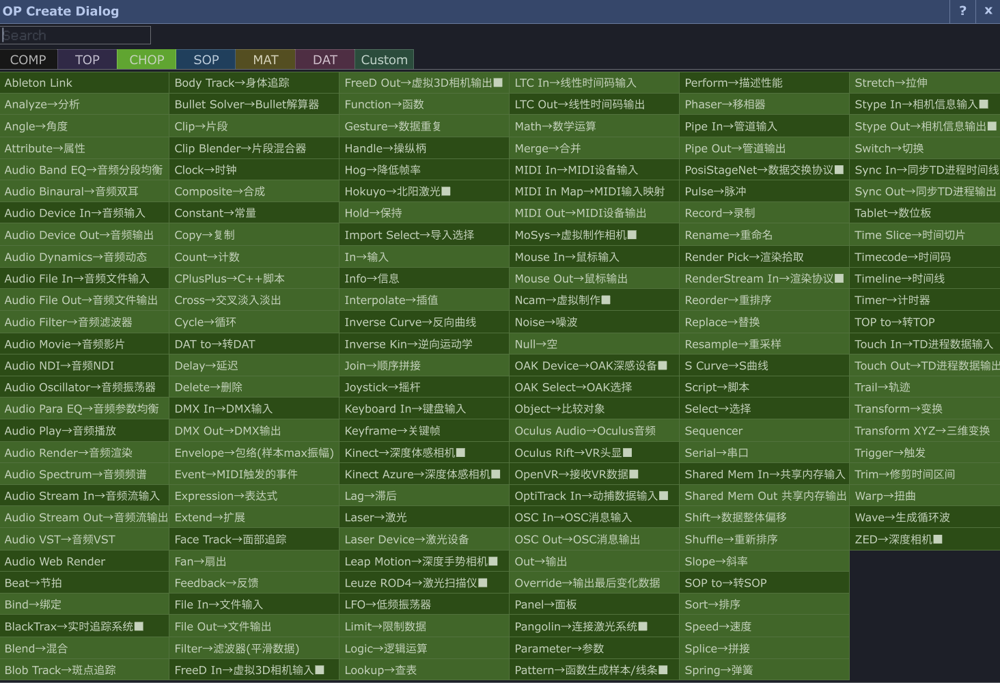
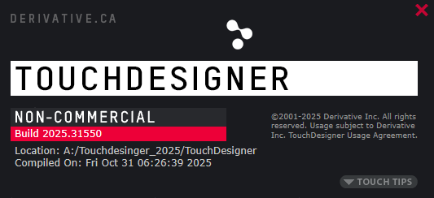
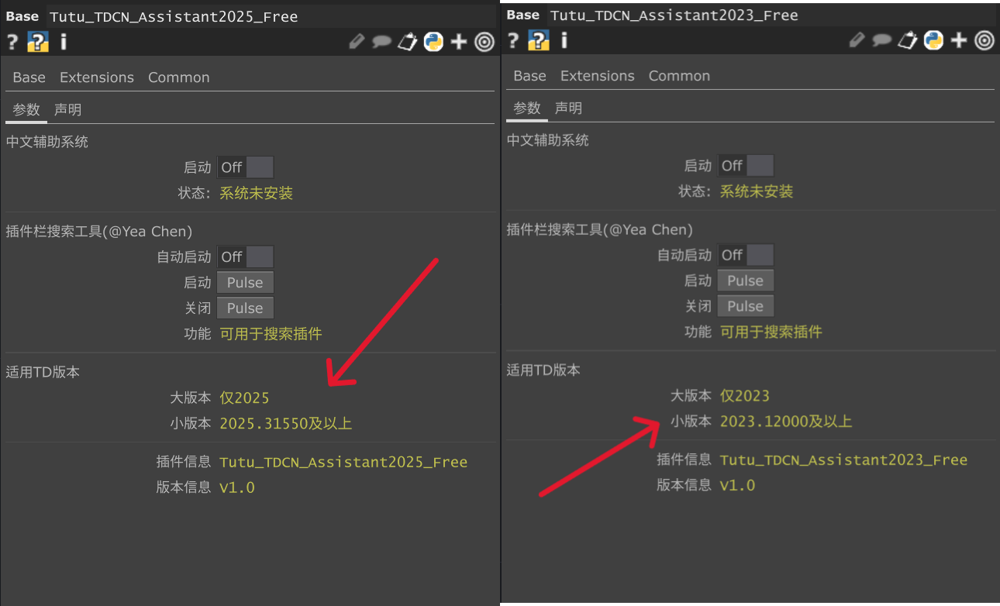

# TouchDesigner中文辅助系统
⚠️本项目为【非官方】第三方辅助工具，与 Derivative无关。使用Python构建的TouchDesigner中文辅助系统，旨在帮助中文用户更轻松地学习和使用TouchDesigner，降低语言门槛，让中文社区更好地理解各类元件的含义与用法。

## ✨ 功能介绍

### 1. 顶部菜单本地化
对 TouchDesigner 界面顶部的菜单与设置项进行中文本地化，方便用户快速找到所需功能，无需逐一对照英文文档。

### 2. OP 创建对话框（中英双语辅助）
在 OP Create Dialog 中，保留原有英文名称的同时附加中文译名，以中英对照的形式呈现，方便用户在熟悉英文术语的同时理解元件含义。

示例：
- `Noise` → `Noise→噪波`
- `Blur` → `Blur→模糊`
- `Math` → `Math→数学运算`

### 3. OP 详细介绍本地化
对 OP Create Dialog 底部的详细说明文字进行本地化，帮助用户更深入地理解每个 OP 的作用与适用场景，学习效率大幅提升。

---

## 📥 使用方法

**第一步：下载并安装 TouchDesigner**

根据需求选择合适的版本进行下载安装：
> 🔗 官方下载地址：[发行 | 导数](https://derivative.ca/download)

**第二步：查看当前 TD 版本**

安装完成后，按下快捷键 `Alt + Shift + V` 可查看当前 TouchDesigner 的版本号。

随后对照插件说明（见下方截图/文档）确认所需插件版本：

**第三步：下载对应版本的插件**

前往 [Releases 页面](../../releases) 下载与你的 TouchDesigner 版本对应的辅助系统插件。

**第四步：拖拽载入工程**

将下载的.tox文件直接拖拽至 TouchDesigner 的.toe工程中即可自动运行，无需额外配置。

---

## 📌 注意事项

- 本辅助系统的翻译采用 **直译 + 用法说明 + 特殊标记** 等多种方式相结合，力求准确传达原文含义，同时兼顾中文用户的使用习惯
- 每次启动 TouchDesigner 时，可自由选择是否自动加载辅助系统
- 本工具不修改任何 TouchDesigner 本体文件，卸载只需将启动参数设置为 `off` 即可，第二次打开工程后将自动恢复为默认英文界面
- 部分OP可能释义不准确，欢迎反馈

---

## 📄 许可协议

*(待补充)*

---

## 💬 联系方式 & 交流社区

使用过程中遇到任何问题，欢迎通过以下方式反馈。无论是功能报错、翻译有误，还是你认为更准确的译法，都非常欢迎告知，每一条建议都会认真查看并持续改进。

- 📧 邮箱：[835386101@qq.com](mailto:835386101@qq.com)
- 💬 微信群：搜索 `Tutu_LXCFANG` 加入交流群

---

## 🙏 支持项目

如果这个项目对你有帮助，欢迎：
- ⭐ 给项目点个 Star
- 📢 分享给身边的 TD 学习者
- 💬 在群聊里提出建议，或将意见发送至邮箱

**为TouchDesigner中文社区而制作❤️**
